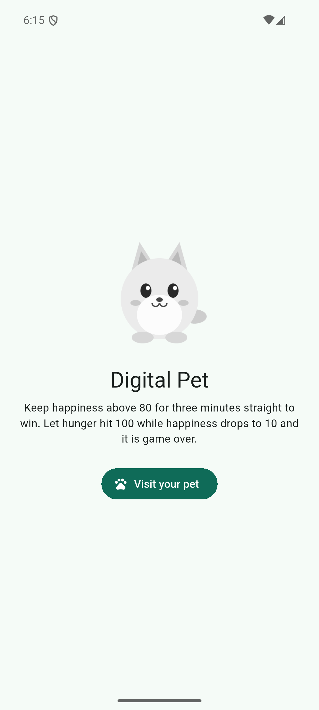
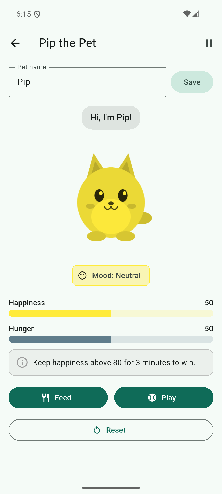
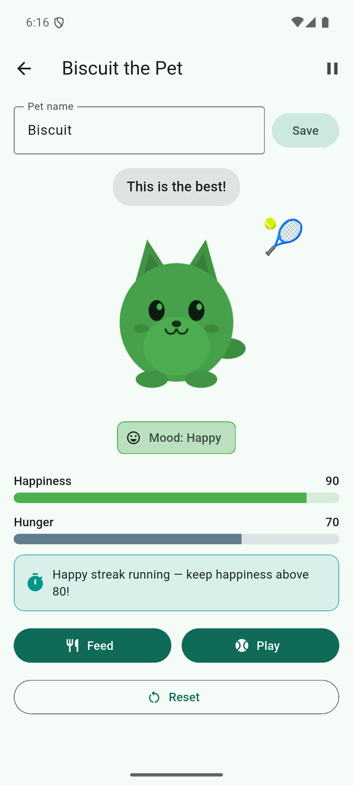
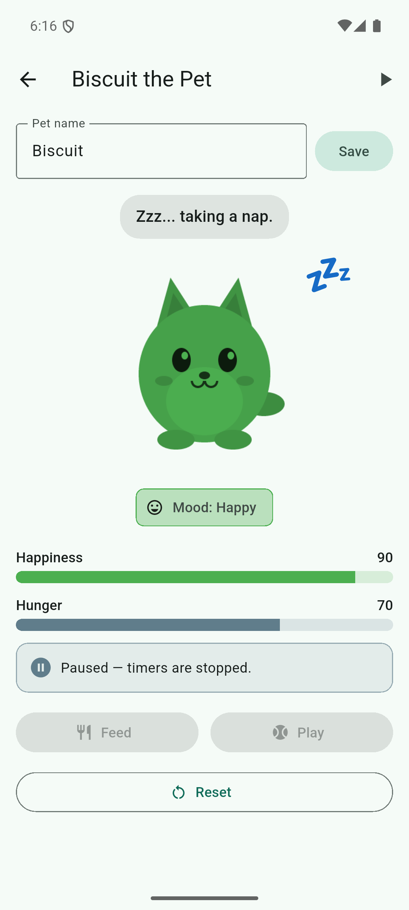
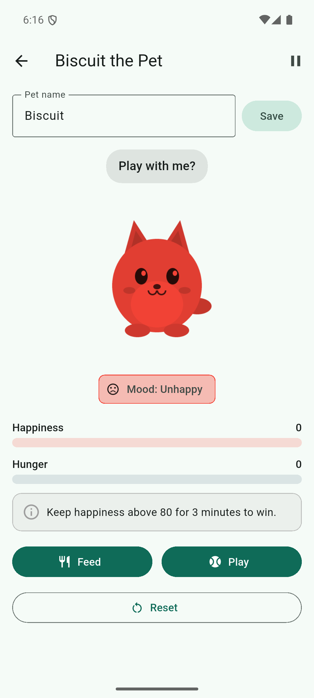

# 🐾 Digital Pet — In-Class Activity 07

A Flutter pet-care app where user actions and time drive visible state changes. Built with local state (`StatefulWidget` + `setState()`), lifecycle-aware timers, and accessible mood feedback.

**Repository:** https://github.com/Howflet/inclass7
**Team:** Team Crispy · **APK:** `DigitalPet_TeamCrispy.apk`
**Pathway:** Undergraduate
**Selected advanced features (2):** Session controls · Visual polish & accessible motion

## Team & roles

| Member | Pathway | Workstream | Roles |
|---|---|---|---|
| Howard Fletcher (002749646) | Undergraduate | Team 1 · Care Systems **and** Team 2 · Pet Personality | Coordinator, state owner, UI owner, quality reviewer |

> **Collaboration note:** I completed this activity solo, so I played both team workstreams. The repository history still follows the two-team workflow. Each workstream was built on its own branch (`team-2/pet-personality`, `team-1/care-systems`) and merged into `main` with a `--no-ff` merge commit, so each contribution is visible in `git log --graph`. No other team was available to do cross-team pull-request reviews, so this README does not claim any. Each branch was checked with `flutter analyze` and `flutter test` before it was merged.

## Setup, run, test, build

```bash
flutter pub get
flutter run                       # debug on emulator/device
flutter analyze                   # static checks
flutter test                      # 21 widget tests
flutter build apk --release       # build/app/outputs/flutter-apk/app-release.apk
```

Tested with Flutter 3.47.2 on an Android emulator (Pixel, Android 16 image, 1080×2400).

## How the game works

| Rule | Value |
|---|---|
| Starting meters | Happiness 50, Hunger 50 (pet name “Pip”, editable) |
| **Feed** | Hunger −10. Happiness +10, or **−20 if the resulting hunger is below 30** (overfed) |
| **Play** | Happiness +10, Hunger +5 |
| **Tap the pet** | Bounce + ❤️ only. It **never changes meters**, so taps can't be spammed toward the win |
| **Hunger timer** | +5 every **30 s**. If a tick would push hunger past 100, hunger is clamped to 100 and happiness −20 (so 95→100 has no penalty and the next tick does) |
| **Bounds** | Every meter is clamped to 0–100 by one `clampMeter()` helper |
| **Mood** | > 70 Happy (green, scale 1.06) · 30–70 Neutral (yellow, 1.0) · < 30 Unhappy (red, 0.94) |
| **Win** | Happiness strictly **> 80** continuously for **3 minutes**. The one-shot timer starts on the first crossing above 80 and is cancelled and cleared at ≤ 80. The next crossing starts a fresh timer |
| **Loss** | Hunger == 100 **and** happiness ≤ 10 |
| **After win or loss** | All timers stop and Feed/Play/Pause are disabled until **Play again** (reset) |
| **Reset** | Restores the initial meters and flags, cancels the win timer, and starts exactly one new hunger timer |

Production values are `kHungerInterval = Duration(seconds: 30)` and `kWinDuration = Duration(minutes: 3)` in [lib/pet_screen.dart](lib/pet_screen.dart). Tests pass shorter durations through the `PetScreen` constructor, so the production constants never need temporary edits.

## Project structure

```
lib/
  main.dart              App + HomeScreen (pushes PetScreen, so leaving the screen tests dispose())
  pet_screen.dart        PetScreen state: meters, actions, timers, outcomes, derived presentation
  widgets/meter_bar.dart Animated 0–100 meter (TweenAnimationBuilder)
assets/pet.png           Light grayscale transparent pet (tinted with ColorFiltered)
test/widget_test.dart    21 widget tests covering the test matrix
```

## Advanced features

| Feature | User flow | State changes & why | Learning outcome | Evidence |
|---|---|---|---|---|
| **Session controls** (pause/resume + restart) | Tap ⏸ in the app bar. The pet naps (💤), the banner reads *Paused — timers are stopped*, and Feed/Play are disabled. Tap ▶ to resume. **Reset / Play again** restarts at any time. Backgrounding the app pauses it automatically (`WidgetsBindingObserver`). | `_paused = true` cancels the hunger timer and the pending win timer. Resuming calls `_startHungerTimer()` (which always cancels first, so only one timer exists) and re-checks the outcome. The win needs *continuous* happy time, so resuming starts a fresh 3-minute streak. | Start/cancel periodic work safely; keep timers consistent with state | Tests *pause stops hunger ticks…* and *pausing cancels the win streak…*; screenshot 04 |
| **Visual polish & accessible motion** (counts as one feature) | Feed/Play/tap makes the pet bounce and shows a 🍖/🎾/❤️ reaction that floats up and fades. Meters glide to new values. The speech bubble cross-fades when the message changes. Coat tint and size follow mood. | Effects implemented: **Action bounce** (`AnimatedScale`), **Action reactions** (`AnimatedSlide` + `AnimatedOpacity`), **Living meters** (`TweenAnimationBuilder`), **Expression switch** (`AnimatedSwitcher` + `ValueKey(_petMessage)`), **Mood tint & size**, **Pet speech** (derived getter, never stored), and **Reduced motion** (`MediaQuery.disableAnimations` → zero durations, no bounce, no slide). Bounce and reaction timers are replaced on every action, so an old callback can't end a newer bounce, and every callback checks `mounted`. | UI derives from one source of truth. Delayed callbacks respect the widget lifecycle | Tests *Mood thresholds 29/30/70/71*, *reduced motion removes the action bounce*, *with motion enabled the pet bounces*; screenshots 02, 03, 05 |

### Feature-to-outcome map (rubric evidence)

| Feature | Learning outcome | Evidence |
|---|---|---|
| Animated bounce | UI responds to state. Delayed callbacks respect the lifecycle | `_celebrate()` cancels the previous `_bounceTimer`/`_reactionTimer` and guards with `mounted`. Both timers are cancelled in `dispose()` |
| Mood tint and size | Color, scale, and label share one `moodFor()` threshold function | 29 → Unhappy/red/0.94 · 30 → Neutral/yellow/1.0 · 70 → Neutral/yellow/1.0 · 71 → Happy/green/1.06. All four are asserted in tests (label text, `ColorFilter.mode(color, BlendMode.modulate)`, and `AnimatedScale.scale`) |
| Smooth meters | `build()` reads state without side effects | The number label always shows the real value and only the bar animates. Feed at hunger 5 shows 5 → 0 |
| Reduced motion | Usable with motion disabled | With `disableAnimations: true` the scale stays 1.0 after an action and every duration is `Duration.zero`. Messages and meters stay visible |
| Session controls | Timer lifecycle tied to state | Pause → 5 s pass → hunger unchanged. Resume → one tick → +5 |

## Test evidence

`flutter analyze` → **No issues found!**
`flutter test` → **All 21 tests passed.**

| Scenario | Expected | Result |
|---|---|---|
| Feed at hunger 5 | Hunger clamps to 0, overfed rule applies | 5→**0**, happiness 50→**30** ✅ |
| Feed at hunger 95 | Hunger 85, happiness +10 | 95→**85**, 50→**60** ✅ |
| Play at happiness 95 (hunger 98) | Both clamp at 100 | Happiness **100**, hunger **100** ✅ |
| Happiness 29 / 30 / 70 / 71 | Unhappy-red / Neutral-yellow / Neutral-yellow / Happy-green, with a text label | All four ✅ (label + tint + scale asserted) |
| Above 80 for (win − 1 ms), then drop to 80 | No win. Timer cancelled and cleared | No win. Streak banner gone. No win 5 s later either ✅ |
| Rise above 80 again and hold for the full duration | Win at exactly the full duration. Hunger timer stops | No win at −1 ms, win at +0. Hunger frozen 30 s after the win ✅ |
| Hunger 95 → 100, then another tick | First tick has no penalty. Second clamps and costs 20 happiness | 100/50, then 100/**30** ✅ |
| Hunger 100 & happiness reaches 10 | Game over, state frozen | Game over at 100/10. Buttons disabled. Values unchanged 10 s later ✅ |
| Reset (tapped twice) after timer ticks | Meters restored, exactly one hunger timer | 60→50, then one tick → **55** (not 60/65) ✅ |
| Leave the pet screen while the timer runs | Timer cancelled, no post-dispose `setState` | Pop the screen, pump 5 min → no exception ✅ |
| Pause / resume | No ticks while paused. Actions disabled | ✅ |
| Name entry | Confirmed name appears. Blank name rejected | “Biscuit the Pet” ✅ / stays “Pip” ✅ |
| Reduced motion on / off | No bounce and zero durations / bounce then settle | ✅ / ✅ |

Win and hunger tests use short constructor durations (10 s win, 1 s tick) with Flutter's fake-async test clock. The production app uses 30 s and 3 min.

**Release smoke test (real device run):** I installed `app-release.apk` on the emulator, opened the pet screen, renamed the pet to Biscuit, played to 90 (green, streak banner shown), paused and resumed, and fed down to 0/0 (red, “Play with me?”). The screenshots below come from that run.

## Screenshots

| Home | Neutral (50) | Happy streak (90) | Paused | Unhappy (0) |
|---|---|---|---|---|
|  |  |  |  |  |

## Accessibility

- Mood is never shown by color alone. A **text label** (“Mood: Happy”), a **face icon**, and the **pet's size** all change with it.
- Meters expose semantics such as “Happiness 90 out of 100”. The pet is announced as “Biscuit, mood Happy. Tap to pet.” The status banner is a live region.
- Reduced-motion support uses `MediaQuery.disableAnimations`.
- The layout scrolls and is width-capped at 480 dp, so it works on small screens and in landscape.

## Asset attribution

`assets/pet.png` is **original artwork created for this project**. It was drawn procedurally with a small Python script, so no third-party images were used. It is released under CC0. The image is light grayscale on a transparent background so `BlendMode.modulate` tints it clearly.

## Issue / branch / PR links

- Branches: `team-2/pet-personality` (asset + animated meter widget) and `team-1/care-systems` (game state, timers, actions, presentation, tests), each merged into `main` with a `--no-ff` merge commit.
- Commit history: https://github.com/Howflet/inclass7/commits/main
